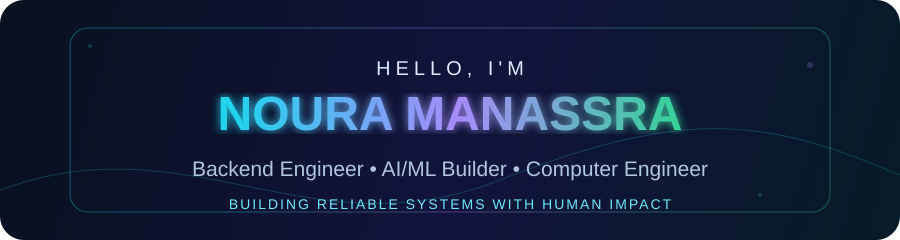

## About me

I'm **Noura Manassra**, a Computer Engineering graduate from **Birzeit University, Palestine**, focused on **Full-Stack Engineering and Artificial Intelligence**.

I enjoy turning difficult, real-world problems into dependable software—whether that means building complete products across frontend and backend, designing APIs, working with databases and machine-learning pipelines, and connecting polished user experiences to reliable services.

- 🎓 Computer Engineering graduate — Birzeit University
- 🏆 Sole recipient of **three Excellence Awards** in the university's 51st graduating cohort
- 🧠 Interested in backend architecture, AI/ML, NLP, databases, APIs, and security
- 🌱 Preparing for graduate study in Artificial Intelligence
- 🤝 Open to Full-Stack, AI/ML, and software-engineering opportunities

## Engineering toolbox

## Selected work

<table>
<tr>
<td width="50%" valign="top">

### 🧠 [NLP Profile Analysis](https://github.com/NManassra/NLP-Project)

Python NLP pipeline for data collection, text and metadata analysis, evaluation metrics, CSV reporting, visualization, and a desktop GUI.

**Focus:** Python · NLP · Data analysis · Evaluation

</td>
<td width="50%" valign="top">

### 🔐 [Secure Client–Server Game](https://github.com/NManassra/Security-Project)

Applied security project exploring protected client–server communication, key exchange, cryptographic operations, and threat-aware implementation.

**Focus:** Python · Security · Networking · Cryptography

</td>
</tr>
<tr>
<td width="50%" valign="top">

### 🌐 [Socket Programming Suite](https://github.com/NManassra/Socket-Programming)

Networking suite covering TCP/UDP clients and servers, multiple clients, HTTP serving, static assets, redirects, and error handling.

**Focus:** Python · Sockets · HTTP · Client/server design

</td>
<td width="50%" valign="top">

### 🤖 AMAN — Graduation Project

Trauma-informed, Arabic audio-first digital support system for children living under continuous exposure in Gaza. Built as a private full-stack project with Flutter, Python backend services, safety-oriented interaction design, and end-to-end verification.

**Focus:** Flutter · Python · APIs · Arabic UX · Responsible technology

</td>
</tr>
<tr>
<td width="50%" valign="top">

### 📊 [Machine Learning](https://github.com/NManassra/Machine-Learning)

Machine-learning coursework centered on preprocessing, exploratory analysis, data integration, experimentation, and evaluation.

**Focus:** Python · ML · Data preparation · Model evaluation

</td>
<td width="50%" valign="top">

### 🧩 [Algorithms Portfolio](https://github.com/NManassra/neetcode-submissions)

A growing collection of interview-focused solutions covering arrays, hashing, two pointers, stacks, graphs, trees, and dynamic problem solving.

**Focus:** Data structures · Algorithms · Complexity

</td>
</tr>
</table>

## Beyond application code

My Computer Engineering background also includes operating systems, concurrency, digital design, Verilog, microprocessors, embedded systems, DSP, robotics, and Linux tooling. These projects strengthen how I reason about performance, reliability, and the layers beneath an application.

### Contribution journey

 

`Full-Stack + AI` · `Systems thinking` · `Technology with purpose`

